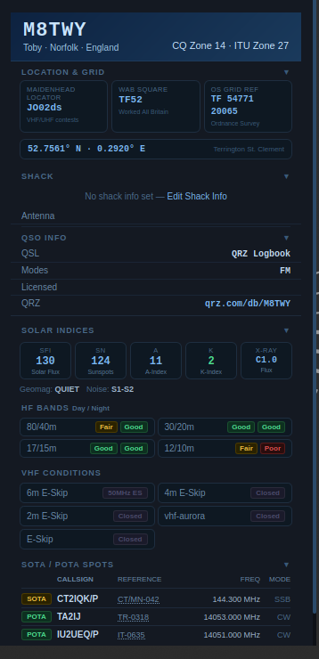
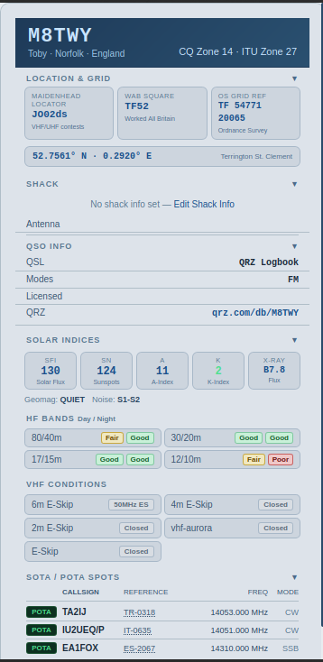
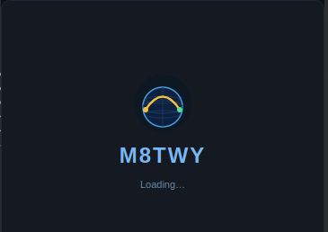

# ShackDash 🎙️

A lightweight amateur radio station desktop widget for Ubuntu/Linux.

Displays real-time solar propagation data, HF/VHF band conditions, station info, and live SOTA/POTA spots — all in a compact, collapsible sidebar widget.

<p align="center">
  
  &nbsp;
  
  &nbsp;
  
</p>

---

## Features

- **Station header** — callsign, name, QTH, CQ/ITU zones
- **Location & Grid** — Maidenhead locator (global), WAB square and OS Grid reference (UK only, hidden automatically for non-UK callsigns)
- **Shack info** — rigs, antenna, calling frequencies, licence class
- **Solar indices** — SFI, SN, A-index, K-index, X-Ray flux
- **HF band conditions** — day/night propagation for 80m through 10m
- **VHF conditions** — E-Skip, aurora, MUF from N0NBH/hamqsl.com
- **SOTA/POTA spots** — live activator spots filtered by your CQ zone, with links to sotl.as and pota.app
- **Light/dark themes** — switchable from the tray menu
- **Collapsible sections** — show only what you need
- **Setup Wizard** — enter postcode (UK) or lat/lon coordinates; Maidenhead, WAB, OS Grid, CQ/ITU zone all calculated automatically

---

## Requirements

- Ubuntu 22.04 / 24.04 / 26.04 LTS (or compatible Debian-based distro)
- Python 3.10+
- GTK3 + WebKit2
- GNOME or compatible desktop with AppIndicator support

---

## Installation

```bash
git clone https://github.com/YOUR_USERNAME/shackdash.git
cd shackdash
./install.sh
```

The installer will:
1. Install Python/GTK dependencies via `apt`
2. Copy files to `~/.local/share/shackdash/`
3. Install and start the local data server as a systemd user service
4. Set up a cron job to refresh solar data every 3 hours
5. Add ShackDash to autostart

If you have an existing `~/shack/` install from before v0.1.4, the installer migrates it automatically.

Then launch:
```bash
python3 ~/.local/share/shackdash/shackdash.py
```

The **Setup Wizard** will open automatically on first run.

---

## Manual Installation

If you prefer not to use the install script:

```bash
# Dependencies
sudo apt install python3-gi python3-gi-cairo gir1.2-gtk-3.0 \
    gir1.2-webkit2-4.1 gir1.2-appindicator3-0.1

# Copy files
mkdir -p ~/.local/share/shackdash
cp *.py *.html *.png *.svg ~/.local/share/shackdash/
cp shack.example.json ~/.local/share/shackdash/shack.json

# Install server service
cp shackdash-server.service ~/.config/systemd/user/
systemctl --user enable --now shackdash-server.service

# Solar data cron (every 3 hours)
(crontab -l; echo "0 */3 * * * /usr/bin/python3 ~/.local/share/shackdash/shackdash_fetch.py") | crontab -
```

---

## Uninstallation

The installer bundles `uninstall.sh` into `~/.local/share/shackdash/`, so you don't need the git repo around to remove ShackDash later. Either:

- **Tray menu → Uninstall ShackDash…** — choose to keep or remove your station data, no terminal needed
- Or run it directly:
  ```bash
  bash ~/.local/share/shackdash/uninstall.sh
  ```

The uninstall script will:
1. Stop and remove the systemd service
2. Remove the cron job
3. Remove the autostart entry
4. Optionally remove `~/.local/share/shackdash/` entirely, or just the ShackDash program files (keeping your `shack.json` config if you plan to reinstall)

---

## Configuration

ShackDash stores your station config in `~/.local/share/shackdash/shack.json`. You can edit this via:
- **Tray menu → Setup Wizard** (first run / full reconfiguration)
- **Tray menu → Edit Shack Info** (quick edits)

See `shack.example.json` for the full config format.

### Location entry
- **UK users**: enter your postcode — Maidenhead, WAB square, OS Grid reference, CQ/ITU zones all calculated automatically
- **Non-UK users**: enter coordinates as `lat,lon` (e.g. `51.5,-0.1`) — Maidenhead and CQ/ITU zones calculated; WAB square and OS Grid reference are UK-specific and hidden automatically for non-UK callsigns

---

## Architecture

```
shackdash.py          — GTK3/WebKit2 wrapper, tray icon, menus
shackdash_widget.html — Widget UI (HTML/CSS/JS)
shackdash_server.py   — Local HTTP server (port 7373), SOTA/POTA proxy
shackdash_fetch.py    — Solar data fetcher (N0NBH/hamqsl.com)
shackdash_setup.py    — Location/grid calculation module
shack.json            — Station configuration
solar.json            — Cached solar data (written by fetcher)
```

The local server runs on `http://127.0.0.1:7373` and serves:
- `solar.json` — propagation data
- `shack.json` — station config
- `/spots` — proxied SOTA/POTA spot data

---

## Solar Data

Solar and propagation data is sourced from [N0NBH/hamqsl.com](https://www.hamqsl.com/solar.html) and refreshed every 3 hours via cron. The widget also detects stale data (e.g. after sleep/hibernate) and refreshes automatically.

---

## SOTA/POTA Spots

Live activator spots are fetched from:
- [SOTA API](https://api2.sota.org.uk) — `api2.sota.org.uk/api/spots/10/all`
- [POTA API](https://api.pota.app) — `api.pota.app/spot/activator`

Spots are filtered to your CQ zone automatically. Callsigns link to QRZ; references link to sotl.as or pota.app.

---

## Licence

GNU General Public License v3.0 — see [LICENSE](LICENSE)

Solar data © N0NBH / hamqsl.com  
SOTA spots © SOTA Mapping Project  
POTA spots © Parks on the Air

---

## 73

Developed by **Toby, M8TWY** — Terrington St Clement, Norfolk, England  
Intermediate licence holder, CQ Zone 14

---

## Development notes

ShackDash was developed with significant assistance from [Claude](https://claude.ai) (Anthropic's AI assistant), used as a coding and design collaborator throughout the project. All feature decisions, testing, debugging and real-world validation were driven by the author. The iterative back-and-forth between human judgement and AI assistance is what shaped the final product.
